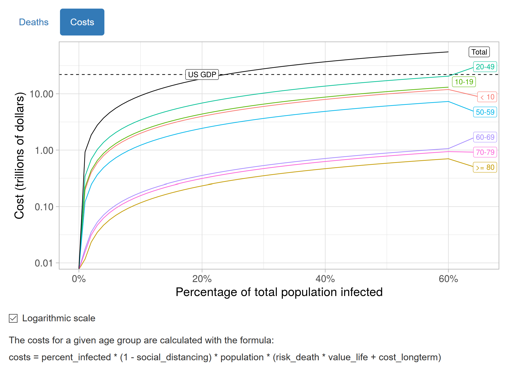

Two COVID-19 related shiny apps: 

One for tracking COVID-19 in United States:

- Uses data from <http://covidtracking.com>.

- Link to the live app: <http://tarko.shinyapps.io/covid>

One for calculating the social costs under different scenarios and assumptions:

- Link to live app: <https://tarko.shinyapps.io/Covid-costs/>

